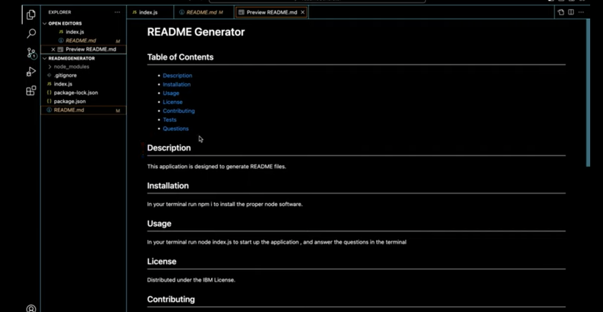

# README generator

## Description
This application generates professional READMEs.

## Install
User will need to have up to date JSON package to run application.

## Usage
In your terminal run node index.js to start up the application , and answer the questions in the terminal 

## CLICK THE SCREENSHOT BELOW!

## Questions
Please send questions to:
steveweede@yahoo.com or Babystu @ GitHub